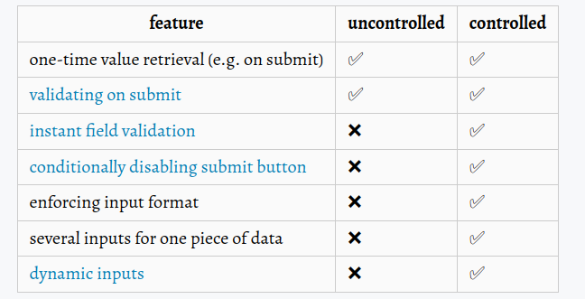

# React's docs best practices and main theory

## Always use composition with props to modify the Components instead of inheritance

- We don't need to use an inheritance solution ot have a custom dialog.
- We can just use props and composition/specialization using props and children:

### - Example:

```jsx
function Dialog(props) {
  return (
    <FancyBorder color="blue">
      <h1 className="Dialog-title">{props.title}</h1>
      <p className="Dialog-message">{props.message}</p>
    </FancyBorder>
  );
}

function HelloDialog() {
  return <Dialog title="Hello" message="Hello world!" />;
}

function WelcomeDialog() {
  return (
    <Dialog title="Welcome" message="Thank you for visiting our spacecraft!" />
  );
}
```

## High-Order Components (HOC)

- Used to reuse component's logic.
- In summary: A HOC is a function that takes a component and returns a new component.

### - HOCs use containers as part o their implementation

- In large apps we have a lot of repeated code into the components and to avoid it we can use the `Container Components` pattern. In which manage events subscriptions and state, and pass props to specific components that handles things like rendering UI.
- We can think in HOCs as Container Components with "extra" parameters.

## Portals

- Used to render children into a DOM node outside the parent hierarchy.
- Normally, when you return an element from a component’s render method, it’s mounted into the DOM as a child of the nearest parent node. But sometimes it's useful to insert a child into a different location.

### - Syntax example:

```jsx
function Modal({ schildren }) {
  const otherParentDomNode = document.getElementById("other-parent");

  return ReactDOM.createPortal(children, otherParentDomNode);
}
```

## Code splitting

- In large apps it's common to have a big bundle and our page loading will be slower than normally.
- Code splitting help us to `lazy loading` just the things that are currently needed by the user, which can dramatically improve the performance of our apps.

### - Import

- `Dynamic import`, it must be configured into the bundling tool. ( webpack, babel, etc... )

```jsx
// before
import { add } from "./math";
console.log(add(16, 26));

// after
import("./math").then((math) => {
  console.log(math.add(16, 26));
});
```

- `React lazy`, Can lazy load a regular component:
- `Suspense`, combined with react lazy can be very useful, it's possible to show some fallback to the user, for example, loading:

```jsx
import React, { Suspense } from "react";

// lazy loading the components
const OtherComponent = React.lazy(() => import("./OtherComponent"));
const AnotherComponent = React.lazy(() => import("./AnotherComponent"));

function MyComponent() {
  return (
    <div>
      {/* showing user fallback, when components is loading */}
      <Suspense fallback={<div>Loading...</div>}>
        <section>
          <OtherComponent />
          <AnotherComponent />
        </section>
      </Suspense>
    </div>
  );
}
```

## Error Boundaries

- Used to catch erros inside their component child tree, log those errors and display an fallback UI instead of the componen tree that crashed. It occurs during rendering, in lifecycle methods.

### - Notes

- It don't work in asyncrhounous code and event handlers.
- Only class components can be error boundaries.

### - Example:

```jsx
class ErrorBoundary extends React.Component {
  constructor(props) {
    super(props);
    this.state = { hasError: false };
  }

  static getDerivedStateFromError(error) {
    // Update state so the next render will show the fallback UI.
    return { hasError: true };
  }

  componentDidCatch(error, errorInfo) {
    // You can also log the error to an error reporting service
    logErrorToMyService(error, errorInfo);
  }

  render() {
    if (this.state.hasError) {
      // You can render any custom fallback UI
      return <h1>Something went wrong.</h1>;
    }

    return this.props.children;
  }
}
```

## Uncontrolled components VS Controlled components

### - Uncontrolled components

- Components that use refs instead of states to manage DOM, for example, a form submission.
- Easier than controlled components and normally used to be better when converting a preexisting codebase to React.

### - Controlled components

- Components that use react state as the “single source of truth”.
- Better than uncontrolled components to set validations and enforcing input formats, masks, etc...

### - Differences:



## Render props

- A component with a prop called `render` that is an function in which receive the component's data and reuse it to render what is nedeed to the use case.

### - Example:

```jsx
class MouseTracker extends React.Component {
  render() {
    return (
      <div>
        <h1>Move the mouse around!</h1>
        {/* mouse has a render prop that return the mouse's {x: 1, y: 1} */}
        <Mouse render={(mouse) => <OtherComponent mouse={mouse} />} />
      </div>
    );
  }
}
```

## Context

- Used to avoid props drilling sharing "global" data for a tree of React Components.

### - Caveat

- Because context uses reference identity to determine when to re-render, it could trigger unintentional renders in consumers when a provider’s parent re-renders.

```jsx
// BEFORE incorrect
class App extends React.Component {
  render() {
    return (
      <MyContext.Provider value={{ something: "something" }}>
        <Toolbar />
      </MyContext.Provider>
    );
  }
}

// AFTER correct, using state to avoid unintentional renders in consumers.
class App extends React.Component {
  constructor(props) {
    super(props);
    this.state = {
      value: { something: "something" },
    };
  }

  render() {
    return (
      <MyContext.Provider value={this.state.value}>
        <Toolbar />
      </MyContext.Provider>
    );
  }
}
```

## Refs

- An way to access DOM nodes or React elements created in the render method.
- Don't overuse refs, avoid using refs for anything that can be done declaratively.

### - When to use:

- Managing focus, text selection, or media playback.
- Triggering imperative animations.
- Integrating with third-party DOM libraries.

## Profiler

- Used to verify how often React components render and re-render and measure those costs. It can be useful to find performance leaks.

### - Example:

```jsx
function Main() {
  render(
    <App>
      <Profiler id="Navigation" onRender={callback}>
        <Navigation {...props} />
      </Profiler>
      <Profiler id="Main" onRender={callback}>
        <Main {...props} />
      </Profiler>
    </App>
  );
}
```

### - onRender callback arguments:

- id, // the "id" prop of the Profiler tree that has just committed
- phase, // either "mount" (if the tree just mounted) or "update" (if it re-rendered)
- actualDuration, // time spent rendering the committed update
- baseDuration, // estimated time to render the entire subtree without memoization
- startTime, // when React began rendering this update
- commitTime, // when React committed this update
- interactions // the Set of interactions belonging to this update

## Optimizing performance

### - Benchamrking tip:

- Prefer to benchmarking performance using the React minified production build. The development version has some warnings and things that help us to develop, but make the app slower.
- Use react profiler with react devtools to verifiy your component's performance.

### - Virtualize long lists:

- Only renders a small subset of long lists, it can dramatically reduce the rendering time and costs.

### - Avoid Reconciliation:

- Before re-render a component react calls the `shouldComponentUpdate(nextProps, nextState)` function, by default it returns true and update all component. Sometimes we don't need to re-render our component, so we can `return false` in this function.

```jsx
class CounterButton extends React.Component {
  constructor(props) {
    super(props);
    this.state = { count: 1 };
  }

  shouldComponentUpdate(nextProps, nextState) {
    const isColorChanged = this.props.color !== nextProps.color;
    const isCountChanged = this.state.count !== nextState.count;
    return isColorChanged || isCountChanged;
  }

  render() {
    return (
      <button
        color={this.props.color}
        onClick={() => this.setState((state) => ({ count: state.count + 1 }))}
      >
        Count: {this.state.count}
      </button>
    );
  }
}
```

- By default react has a default compairson of current and previous props and state inheriting from `React.PureComponent`.

```jsx
class CounterButton extends React.PureComponent {
  constructor(props) {
    super(props);
    this.state = { count: 1 };
  }

  render() {
    return (
      <button
        color={this.props.color}
        onClick={() => this.setState((state) => ({ count: state.count + 1 }))}
      >
        Count: {this.state.count}
      </button>
    );
  }
}
```

### - Not mutating data:

- Avoids to change state when is not needed also using objects and arrays because of its references. It's possible to use `spread operator`, for example:

```jsx
// arrays correct:
handleClick() {
  this.setState(state => ({
    words: [...state.words, 'marklar'],
  }));
};

// objects correct:
setColor({...colormap, right: 'blue'});
```

# React's hooks best practices and main theory
